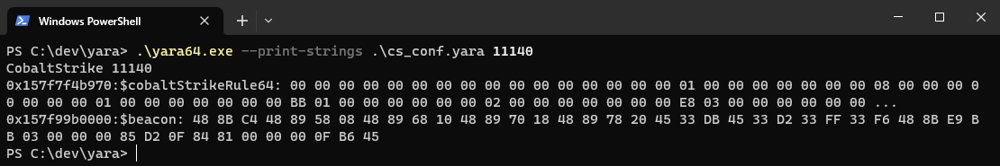
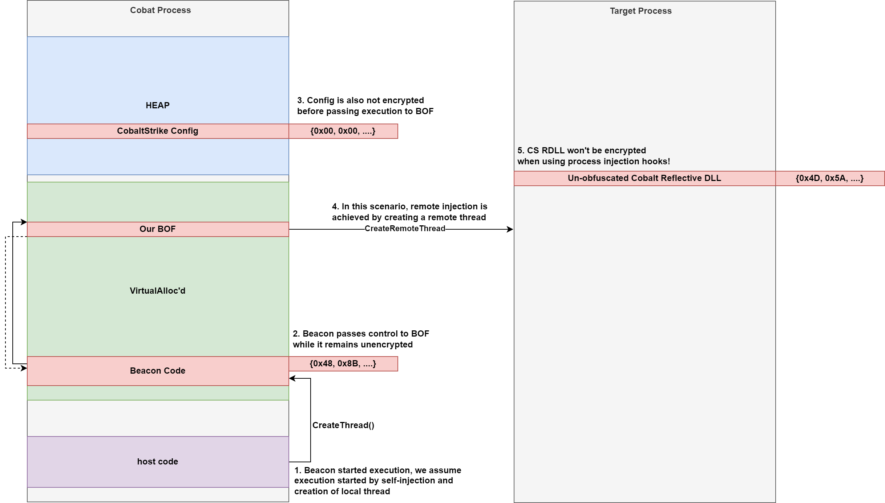

## Tldr

While the sleep mask kit is doing a great job at encrypting the beacon at rest, the beacon resides unencrypted in memory during the execution of BOFs. This leads to detection if a memory scan is performed during the execution of the BOF. To overcome this, we encrypt the beacon memory and configuration block at the beginning of the BOF and decrypt them at the end of the BOF. 

This article walk through the thought process that led to the creation of bofryptor, a BOF that will encrypt the beacon while BOFs are being executed to avoid memory scanners.

## Introduction

Most modern enterprises are leveraging Endpoint Detection and Response solutions that are capable of detecting malware based on static signatures as well as runtime behavior. A detection technique that is recently gaining some heat is memory scanning. In memory scanning, an EDR would scan the memory of a process to find either suspicious attributes that, for example, indicates injection, or signatures of known malicious tools. As a response to memory scanning, adversary simulation frameworks such as Cobalt Strike (CS) are offering capabilities to obfuscate the beacon while sleeping. Because a beacon remains asleep for most of its lifetime, it is usually assumed that encrypting the beacon during sleep is good enough. However, while experimenting with the [process injection hooks](https://hstechdocs.helpsystems.com/manuals/cobaltstrike/current/userguide/content/topics/malleable-c2-extend_control-process-injection.htm) using the [static syscalls example](https://github.com/ajpc500/BOFs/tree/main/StaticSyscallsInject), we noticed that Microsoft Defender for Endpoint (ATP) would trigger an `Ongoing hands-on-keyboard attacker activity detected (Cobalt Strike)` alert.  We thought that the alert is too specific to be based only on the process injection behavior, so we investigated it, and this blog post is the outcome of the investigation.

## The Trigger
The first thing to find out was the trigger. Since the alert is only triggered when the static syscalls BOF is executed (execution of other BOFs was undetected), a good starting point was to identify exactly which point in the code caused the trigger. We commented out code snippets and reran the static syscall injection BOF until the culprit was found: `NtCreateThreadEx`. Once we identified the trigger, we wanted to know why it triggered. There were three possibilities
1. The use of Syscalls
2. The fact that the post-ex capability lived unobfuscated in the memory of the target process
3. The memory of the beacon process contained an indicator

Starting with the second option was the most logical because it was the quickest to validate. The idea is that using the process injection hooks will overwrite the process-inject settings in the Malleable C2 profile. As a result, the CS post-ex capability will live in the memory of the target process unobfuscated, and that seemed like a reliable indicator of CS prescence. This assumption was tested by injecting nop slids instead of the post-ex capability. However, ATP still detected our beacon so we moved on to the next possibility, which is syscalls usage. The call to `NtCreateThreadEx` was replaced with `CreateRemoteThread` to confirm if the usage of syscalls is the culprit. However, that did not work out as well, which leaves us with the possibility of having a potential indicator in our beacon process memory. To test the last option, `NtCreateThreadEx` was replaced with a simple `Sleep` function, and a set of known yara rules were run against our beacon, and voila! Our beacon was detected as Cobalt Strike, and since the yara rules are specific to Cobalt Strike, this makes the third possiblity the most liekly one.



This clarified the specific Cobalt Strike trigger: `NtCreateThreadEx` and `CreateRemoteThread` both triggered a memory scan while the beacon was residing in unencrypted in memory. The following diagram depicts the layout of the beacon memory at the moment of the EDR trigger. When we run a BOF, the beacon code (COFF Loader) will call our BOF entry function (`go()`) and the BOF will be executed. The beacon *does not encrypt itself* before it calls the BOF entry. As a result, if a memory scan is triggered while the BOF is executing, the beacon code can be detected as CS in memory. Even if the beacon code is encrypted, the configuration is enough to trigger a signature-based detection that is specific to Cobalt Strike.





## The Challenge

Now that the trigger is known, the challenge is to bypass it. Two memory regions must be obfuscated: the beacon code itself and the configuration in the heap. One cool thing about the sleep mask kit is that it provides you with pointers to all the relevant memory regions. All you have to do is encrypt these regions. In our situation, we are handed nothing and must do the search ourselves. Luckily, that is possible.

### The Beacon Code

The beacon code can be found by searching the memory of our process for the same signature that ATP is using. Once the signature is found, we know that we are in the right place and can encrypt the signature. However, scanning the entire memory for the signature can be slow. We could improve that by only scanning RX regions, but there is another trick ;-)

We can use the compiler intrinsic function `__builtin_return_address()` to obtain the address of the function that called the BOF's `go()`. Since the beacon is the caller of the `go()` function, we are certain that the return address received is somewhere inside the beacon code. Equipped with that knowledge we can then call `VirtualQuery()` to obtain the base address for the beacon region. This region is allocated by the reflective loader and we can encrypt it knowing that only the beacon code resides in that region. The following is a code snippet of the process

```c
void go(char *args, int len){
    LPVOID retAddr = __builtin_return_address(0); // to obtain an address inside the beacon memory region
    MEMORY_BASIC_INFORMATION mbi = {0};
    if(VirtualQueryEx(GetCurrentProcess(), retAddr, &mbi, sizeof(mbi))){
        // 1) encrypt the beacon code
        // 2) execute BOF functions
        // 3) decrypt beacon code
        // 4) return
    }
}
```

However, this presents a challenge: if the beacon code is encrypted, the beacon helper functions like `BeaconPrintf()` cannot be invoked. This is inconvenient at best. To solve this, we attempted to only encrypt the known yara signature inside the beacon code instead of encrypting the entire beacon code. While this allowed for the usage of helper functions, ATP still detected the beacon and therefore another approach was needed. Our response to this challenge was to encrypt the beacon just before the action triggering the memory scan and then decrypting it after a few seconds of sleeping. This trick allowed us to use beacon helper functions and avoid the detection through the memory scan.

```c
void func_with_suspicious_call(){
    do_actions();
    BeaconPrintf(CALLBACK_OUTPUT, "this is a cool blog, I am enjoying it!");
    
    ENCRYPT_BEACON //this is a macro that will invoke the encryption logic
    do_suspicious_call(); //something like NtCreateRemoteThread()
    DECRYPT_BEACON //this is a macro that will invoke the decryption logic
    BeaconPrintf(CALLBACK_OUTPUT, "It works!");
}

void go(char *args, int len){
    LPVOID retAddr = __builtin_return_address(0);
    MEMORY_BASIC_INFORMATION mbi = {0};
    if(VirtualQueryEx(GetCurrentProcess(), retAddr, &mbi, sizeof(mbi))){
        // 1) encrypt the beacon code
        // 2) execute BOF functions
        // 3) decrypt beacon code
        // 4) return
    }
}
```


### The Beacon Configuration

Accessing the beacon code was relatively easy because of the `__builtin_return_address()` intrinsic. However, we are unaware of any direct method by which we can obtain a pointer to the beacon configuration block. Therefore, finding the configuration block was done the hard way by searching the memory for the known signature. To speed up the search process, we looked for characteristics specific to the configuration block, and the following was found to be true while testing with multiple malleable profiles 

1. The beacon allocates configuration block in the heap
2. The allocation block size is 2048 bytes

Equipped with this knowledge we can walk the heap and identify configuration block

```c
BOOL FindBeaconConfigInHeap(PSHORT size)
{
    PROCESS_HEAP_ENTRY entry = {0};
    DWORD LastError;
    HANDLE hHeap = GetProcessHeap();

    while (HeapWalk(hHeap, &entry))
    {
        if (entry.cbData == 2048) // To speed up search, we only scan heap blocks of 2MB
        {
            if (FindSignature((LPBYTE)entry.lpData, entry.cbData))	// FindSignature will check for beacon config signature
            {
                // This is the beacon configuration block in the heap
            }
        }
    }
    return FALSE;
}
```


## The Future and Alternatives

Although heap walking is not that time-consuming, it could be improved by using an initialization BOF to walk the heap only once and then pass the memory address of the configuration block to subsequent BOFs as done by [Henri Nurmi](https://twitter.com/HenriNurmi) in his [cs-token-vault](https://github.com/Henkru/cs-token-vault) project. In addition, instead of explicitly calling encrypt\decrypt on each suspicious call, one could implement hooks as done by [WithSecure](https://twitter.com/WithSecure) in their excellent [Bypassing Windows Defender Runtime Scanning](https://labs.withsecure.com/publications/bypassing-windows-defender-runtime-scanning) article. The article leverages `PAGE_NOACCESS` protection mask instead of using encryption.

Furthermore, an alternative to searching through the heap for a signature is to walk through the heaps and encrypt all of them as done by Waldo-Irc in his [Hook Heaps and Live Free](https://www.arashparsa.com/hook-heaps-and-live-free/) article. For the `PAGE_NOACCESS` technique, [Mariusz Banach](https://twitter.com/mariuszbit) touches on leveraging VEH exception handling as an alternative to calling VirtualProtect twice in his [Shellcode Fluctuation Github Repository](https://github.com/mgeeky/ShellcodeFluctuation).

During the implementation phase we reached out to Cobalt Strike team and they suggested hooking HeapAlloc [in the same manner as AceLdr is doing it](https://github.com/kyleavery/AceLdr), a good suggestion for those implementing their own UDRL. It would be nice indeed to have a beacon helper function named BeaconGetSleepParams() or BeaconGetPointers() that will remove the need to scan the heap or find the caller address before encryption.


## The POC

The PoC for this article can be found on [the accompanying GitHub repository](https://github.com/securifybv/BOFRyptor). A word of caution though: this article and associated code was written and tested on January 2023. CS team pushed two updates since the implementation of the code, things might have changed, so please do your due diligence before using the POC in production with newer versions.


## The References

The following articles proved helpful during the investigation and implementation

1. [Bypassing Windows Defender Runtime Scanning](https://labs.withsecure.com/publications/bypassing-windows-defender-runtime-scanning)
2. [Hook Heaps and Live Free](https://www.arashparsa.com/hook-heaps-and-live-free/)
3. [AceLdr GitHub Repository](https://github.com/kyleavery/AceLdr)
4. [Alternative use cases for SystemFunction032](https://s3cur3th1ssh1t.github.io/SystemFunction032_Shellcode/)
5. [Shellcode Fluctuation Github Repository](https://github.com/mgeeky/ShellcodeFluctuation)
6. [Process Injection Updates in Cobalt Strike 4.5](https://www.cobaltstrike.com/blog/process-injection-update-in-cobalt-strike-4-5)

Big thanks to the authors of these articles and the CS team for consistently contributing to the community!


## The Author

This blog and associated code was written by Yasser Alhazmi ([@Yas_o_h](https://twitter.com/yas_o_h)).
